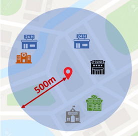
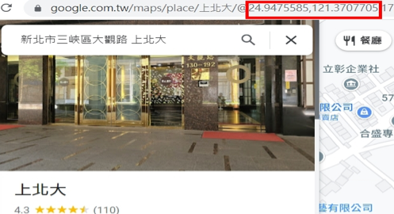
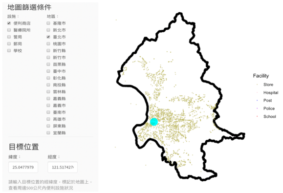
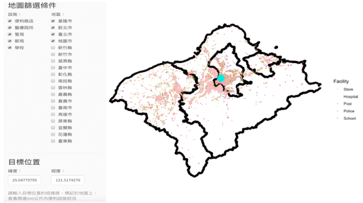
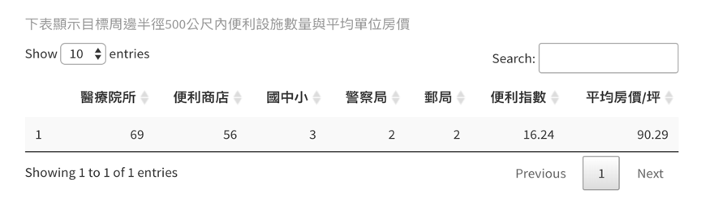
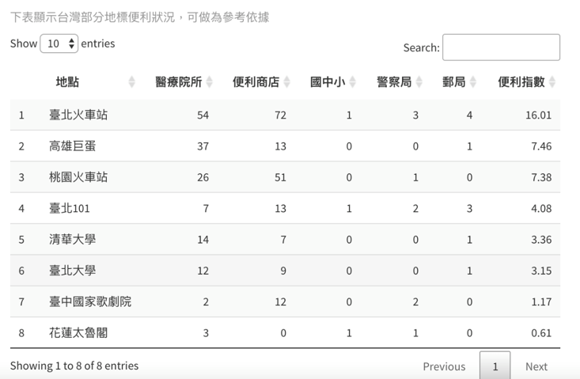
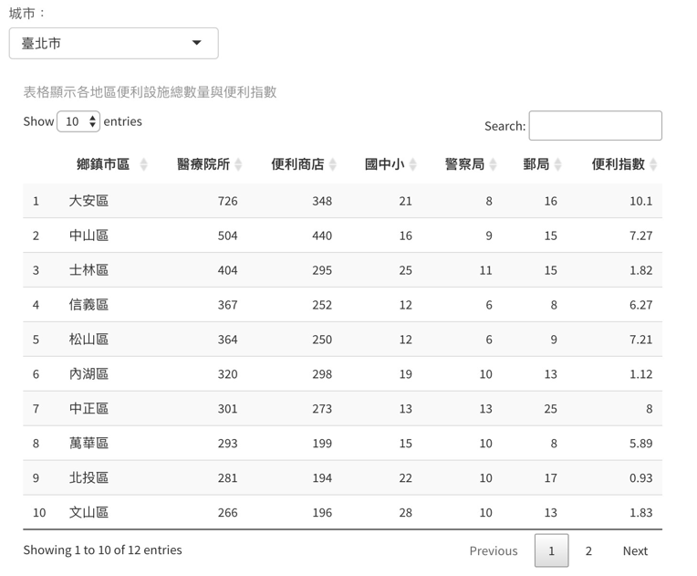
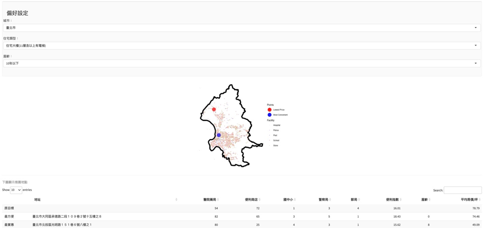

# 從便利指數評估臺灣各區生活便利性
## 專題摘要
成果網站網址：https://taiwanconvenienceindex.shinyapps.io/Convenience_Index2/

便利指數可用於評估地區的生活便利性，對城市規劃、政策制定和購屋決策具有參考價值。本研究使用非線性迴歸模型建立便利指數，並使用R語言中的shiny套件打造出「Shine Your Life」網頁展示研究成果。
我們透過最小平方法和迴歸分析，試圖從房價與周遭便利性之相關性中，建立便利指數。因此首先透過政府開放資料平台收集全臺便利商店、醫院藥局、國中小、警察局、郵局的地址資料，並使用內政部不動產交易實價查詢服務網獲取了臺北市近一年的不動產交易紀錄，以每個地址為圓心，在半徑500公尺範圍內計算了各項設施的數量，如圖所示。

接著將臺北市的房價作為反應變數，另外選擇房屋型態(透天、住宅大樓)、屋齡、便利商店、醫療院所、郵局、警察局、學校的數量等八項指標作為解釋變數，觀察這些指標與房價之間關係，並建立一個非線性迴歸模型。按比例縮放非線性模型計算出的五項便利指標系數，使總和為1。最後將這五項變數成為計算便利指數的依據算出：

**便利指數=0.061×便利商店數量+0.163×醫療院所數量+0.655郵局數量+0.061 × 警察局數量+0.061 × 學校數量**

為了讓使用者更方便地使用和理解研究成果，我們開發了一個名為「Shine Your Life」的系統，打造出互動式的區域地圖選單，展示各種交互式圖表、表格、地圖等，根據使用者的需求自行篩選適合的條件，自由輸入經緯度，查看相對應的圖表，利用資料視覺化，透過地圖讓使用者能快速且直覺地了解各區域的生活便利狀況。除此之外，我們也打造房地產推薦系統，透過系統可以取得相同房價中最便利的房屋、相同便利性中最便宜的房屋。

「Shine Your Life」中的其中一項特色功能是能自行設定目標位置便能查看周邊的便利程度，因此第一步是至Google Map輸入地址，複製經緯度，填入到「Shine Your Life」系統中，查詢方式如圖二所示：

「Shine Your Life」的實際頁面如圖三所示，當篩選條件為「便利商店」與「臺北市」，目標位置設定為臺北車站時，地圖顯示的便是臺北市範圍內便利商店的具體分布情形，青色的圓形標記則代表臺北車站的所在地點，可以看到在臺北市內便利超商分布十分密集。

根據圖四則可以看到在基隆市、新北市、臺北市、桃園市的範圍內，各種便利設施的具體分布情形，如便利商店、醫療院所、警局、郵局、學校，明顯可以各種便利設施在北部區域分布都十分密集，青色的圓形標記則同樣代表臺北車站的所在地點。

而在輸入目標位置經緯度後，除了地圖顯示的功能外，系統也將自動計算出目標周邊半徑500公尺內便利設施數量與平均單位房價，圖五為以臺北小巨蛋作為目標的範例。根據圖片中的資訊可以看到在臺北小巨蛋的周圍500公尺內包含69間醫療院所、56間便利商店、3間國中國小、2間警察局、2郵局，綜合評估後的便利指數為16.24，平均每坪房價90.29萬元。

為了方便使用者進行比較，在系統中也顯示了臺灣部分地標的便利狀況，以供參考，如圖六所示。

我們也將全臺本島共352個鄉鎮市區進行評比，除了統計各個行政區內的便利設施總數量之外，也在每個行政區內隨機抽取50點座標，透過計算這50點的便利指數平均值，藉以得出代表每個地區的平均便利指數，讓使用者能快速了解全臺各個地區的便利狀況，如圖七所示。

除了上述功能之外，我們也將便利指數與房價結合，打造出房地產推薦系統，透過系統可以取得相同房價中最便利的房屋、相同便利性中最便宜的房屋。如圖八所示，推薦系統首先將圖三中使用者輸入的座標作為基準，接著根據使用者勾選的房屋偏好設定，包含：城市、住宅類型、屋齡三項依據，依其所好，即時運算，推薦出最方便與最實惠的兩間房子。

受到經費不足的影響，我們目前所使用的是免費版本的Shiny系統，因此網站背後的容量與運算量受到限制，無法上傳全臺灣的房地產交易紀錄資料，因此目前此推薦功能與周邊房價計算只適用於台北市、新北市、桃園市，不過我們認為「Shine Your Life」目前仍只是個原型，若能有更多的資源與經費，這將是一個充滿未來潛力和發展性的工具。
